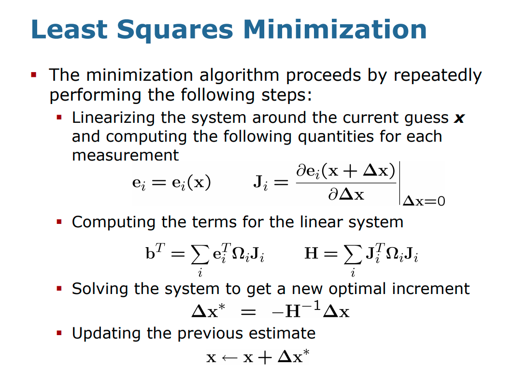

# Least-Squares-Odometry-Calibration
A calibration method for odometry of mobile robots based on nonlinear Least-squares technique.

## Dependencies

## Running Instructions

## Brief Explanation
Calibration is the process of find the extrinsic and intrinsic parameters of the sensor that causes it's readings to deviate from ground truth measurements. So, calibration is an essential step in preparing the sensors for real-world applications. There are different techniques to achieve calibration, one such is using Non-linear least squares minimization. This is an offline calibration technique which requires groud truth data. 

The steps involved in a least squares minimization is shown in the figure below. 

